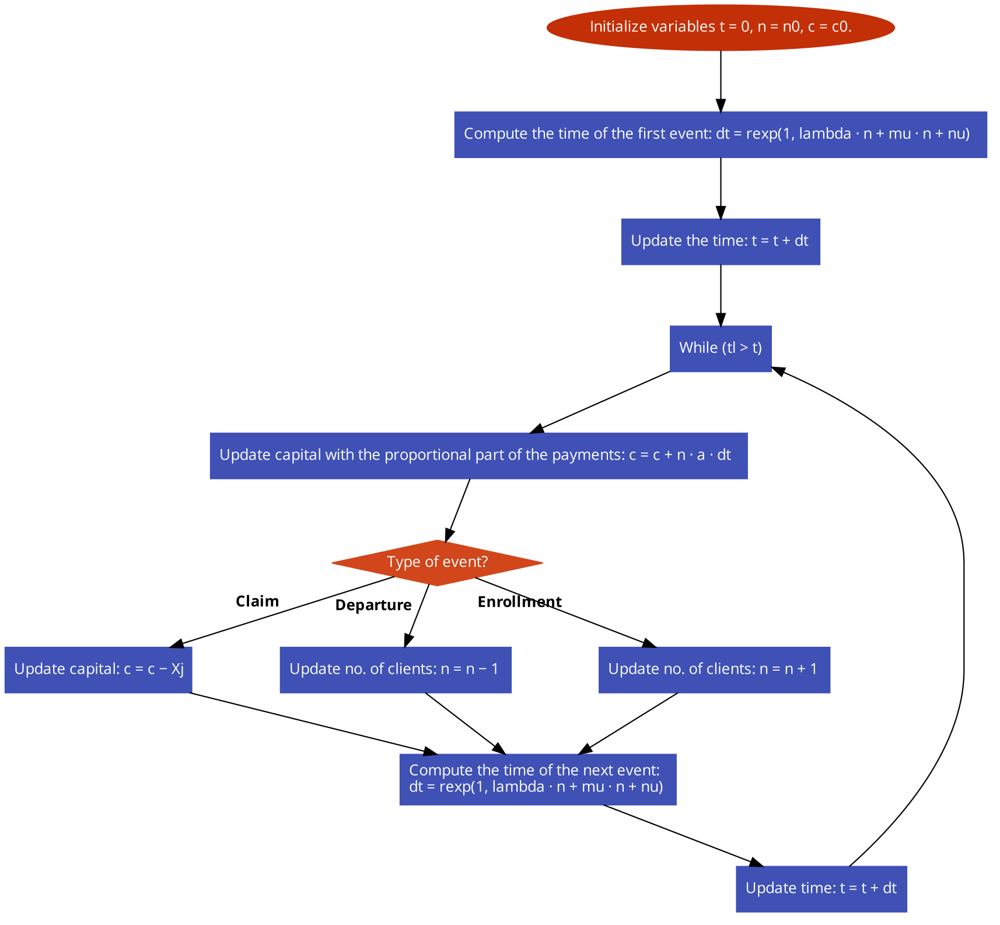

```{r setup, include=FALSE}
knitr::opts_chunk$set(echo = TRUE)
```
# Contents

- **Introduction**
- **The project**
- **Results**
- **Conclusions**
- **References**

# Introduction

- Goal:
    - Compute the probability that the capital of an insurance company remains positive during a given time period
- Data:
  - Premium: $a$
  - Claims rate: $Poisson (\lambda)$
  - Premium amount: $Pareto (2.5, 100)$
  - Enrollment rate: $Poisson(\nu)$
  - Departure rate: $Exp(\mu)$
  - Initial capital: $c_0$

# Introduction

So in general, the capital of the company at any time $t$ will be: 

$$C(t) = c_0 + at(n_0+N_A(t)-N_D(t)) - \sum_{j=1}^{N_C(t)} X_j$$

where:
\begin{itemize}
\item $N_A(t)$ is the number of clients that arrive by time $t$
\item $N_D(t)$ is the number of clients that leave by time $t$
\item $N_C(t)$ is the number of claims that arrive by time $t$
\item $X_j$ is the amount of the $j$-th claim
\item $n(t)$ is the number of clients at time $t$.
\end{itemize}


# The project 




# Results

Numerical results, quality assessment of the approximations, and time efficiency of the algorithms. Use tables and/or charts.

# Conclusions

About the results, how the difficulties were solved, and possible alternative approaches. Keep the focus, the conclusions must be as brief as possible.

# References

Including textbooks, webpages, and class notes.